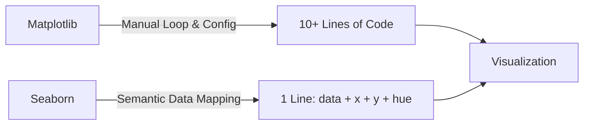

# 🎨 Week 5 Day 4 — Seaborn Basics & Statistical Visualization

> **Core Objective:** Master Seaborn's high-level statistical plotting engine. Learn how Seaborn automates aggregation, grouping, color mapping, and legends with a single `hue=` argument, turning complex data into intuitive, publication-ready graphics.

---

## 🧭 Why Seaborn? The Fundamental Shift



* **Matplotlib:** You tell Python *how* to draw every bar, tick, and legend item manually.
* **Seaborn:** You tell Python *what* column to plot and *what* category to split by (`hue=`); Seaborn handles grouping, coloring, and legend generation automatically.

---

## 1. 🎭 Seaborn Global Themes

Control the aesthetic canvas of your visualizations with one line:

```python
import seaborn as sns
sns.set_style('whitegrid')  # The industry standard
```

| Theme | Visual Style | Best Use Case |
|---|---|---|
| `'whitegrid'` | White background with subtle grid lines | Reports, dashboards, and numerical comparisons (default recommendation) |
| `'darkgrid'` | Grey background with white grid lines | Exploratory data analysis, dark-mode displays |
| `'white'` | Pure white background, no grid lines | Clean academic papers and print media |
| `'dark'` | Clean grey background, no grid lines | Modern presentation slides |
| `'ticks'` | White background with black axis tick marks | Formal scientific publications |

---

## 2. 📊 Core Statistical Plots & Use Cases

| Plot Function | Statistical Purpose | Key Parameters | Behind the Scenes |
|---|---|---|---|
| `sns.histplot()` | Distribution of a single continuous variable | `x`, `bins`, `kde=True`, `hue`, `multiple='stack'` | Calculates bin frequencies and density curves |
| `sns.barplot()` | Compare group averages (means) | `x`, `y`, `hue`, `palette`, `ci` / `errorbar` | Computes `df.groupby(x)[y].mean()` automatically |
| `sns.boxplot()` | Five-number summary + outlier detection | `x`, `y`, `hue`, `showfliers=False` | Computes Median, Q1 (25%), Q3 (75%), and 1.5×IQR whiskers |
| `sns.scatterplot()` | Relationship between two continuous variables | `x`, `y`, `hue`, `size`, `alpha` | Plots (X, Y) coordinate points with semantic hue |
| `sns.heatmap()` | 2D matrix of values (correlations / pivots) | `annot=True`, `fmt='.2f'`, `cmap`, `vmin`, `vmax` | Color-codes a 2D numeric grid |
| `sns.pairplot()` | Pairwise bivariate relationships across dataset | `hue`, `diag_kind='kde'`, `palette` | Generates an N×N matrix of scatter plots and distributions |

---

## 3. 📦 Deep Dive: Understanding the Boxplot

A boxplot partitions sorted continuous data into four equal quartiles:

```text
               • 100   <-- Outlier (value > Q3 + 1.5 * IQR)
               
        ┌─────────────┐
  ──────┤     70      ├──────
        └─────────────┘
  50          70            85
   ↑           ↑             ↑
Lower       Median         Upper
Whisker     (50th %)      Whisker
(Min Normal)             (Max Normal)
```

### Statistical Anatomy:
1. **Median (Line inside box):** Middle value (50th percentile). Resistant to extreme outliers.
2. **IQR (Interquartile Range - The Box):** Spans from Q1 (25th percentile) to Q3 (75th percentile). Contains the middle 50% of the population.
3. **Whiskers:** Extend to the lowest and highest data points within $1.5 \times \text{IQR}$.
4. **Outlier Dots (Fliers):** Points that fall beyond the whiskers ($> 1.5 \times \text{IQR}$), signaling abnormal or extreme observations.

---

## 4. 🚀 The Superpower of `hue=`

In Matplotlib, splitting a chart by category requires filtering rows, drawing separate lines/bars, setting colors manually, and calling `plt.legend()`.

In Seaborn:
```python
sns.histplot(data=tips, x='total_bill', bins=20, hue='time', multiple='stack')
```
**`hue='time'` automatically:**
1. Splits data into subgroups (`Lunch` vs `Dinner`).
2. Assigns distinct, aesthetically pleasing colors.
3. Formats and labels the legend without requiring `plt.legend()`.

### Handling Overlapping Groups with `multiple=`:
* `multiple='stack'`: Stacks category bars vertically on top of each other.
* `multiple='dodge'`: Places category bars side-by-side.
* `multiple='layer'`: Overlays semi-transparent bars (default).
* `multiple='fill'`: Normalizes bars to 100% height to compare relative percentages.

---

## 5. 🔥 Reading Correlation Matrices with `sns.heatmap()`

```python
correlation = df.corr(numeric_only=True)
sns.heatmap(correlation, annot=True, fmt='.2f', cmap='coolwarm', vmin=-1, vmax=1)
```

### Correlation Interpretation Rules:
* `+1.00`: Perfect positive relationship (as X rises, Y rises in lockstep).
* `+0.70` to `+0.90`: Strong positive correlation.
* `+0.40` to `+0.60`: Moderate positive correlation.
* `0.00` to `±0.30`: Weak or no linear correlation.
* `-0.40` to `-0.90`: Moderate to strong negative correlation (as X rises, Y drops).
* `-1.00`: Perfect inverse relationship.

> [!IMPORTANT]
> **Always set `vmin=-1` and `vmax=1` on correlation heatmaps!** If `vmin` defaults to 0, all negative correlations get clipped to the baseline color, completely blinding you to inverse relationships.

---

## 🎯 Day 4 Key Takeaways

1. **Seaborn is statistical:** It calculates distributions, medians, and averages internally—saving dozens of lines of pandas aggregation.
2. **`hue=` is your primary tool:** Use it to add a categorical grouping dimension to any 2D chart.
3. **Boxplots reveal truth:** Don't rely solely on averages (`mean()`); use boxplots to inspect spread, skewness, and outliers.
