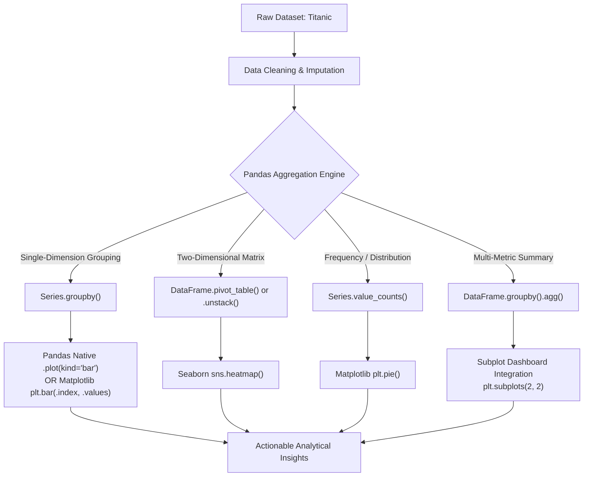

# 📊 Week 5 Day 6 — Pandas + Matplotlib & Seaborn Integration

> **Core Objective:** Master the end-to-end data science bridge: transform raw data with Pandas aggregations (`groupby`, `pivot_table`, `value_counts`, `.agg()`) and render production-grade visualizations directly with Matplotlib and Seaborn.

---

## 🧭 Visual Learning Architecture



---

## 1. 🔍 Statistical Imputation: Deconstructing Categorical Fillna

Before visualizing data, missing values must be handled with mathematically and statistically sound methods.

```python
titanic['Embarked'] = titanic['Embarked'].fillna(titanic['Embarked'].mode()[0])
```

### 🔬 Anatomy of the Statement

| Component | Technical Role | Why It Matters |
|---|---|---|
| `titanic['Embarked']` | **Target Series Extraction** | Isolates the single categorical column representing boarding ports (`S`, `C`, `Q`). |
| `.mode()` | **Categorical Central Tendency** | Calculates the most frequent value. Text categories cannot be averaged (`mean()`) or ranked continuously (`median()`). |
| `[0]` | **Scalar Unpacking** | Pandas `.mode()` **always returns a Series**, not a scalar string (in case there is a tie for first place). `[0]` pulls the raw string `'S'`. |
| `.fillna(...)` | **Imputation Engine** | Scans every row: leaves valid strings intact and replaces `NaN` with the provided scalar value. |
| `titanic['Embarked'] =` | **Safe Reassignment** | Overwrites the original column. Never combine assignment with `inplace=True`, as that returns `None` and wipes your data! |

> [!WARNING]
> **The `inplace=True` Trap:**
> ```python
> # ❌ CRITICAL BUG: Evaluates to None and deletes your entire column!
> titanic['Embarked'] = titanic['Embarked'].fillna('S', inplace=True)
>
> # ✅ CORRECT: Standard reassignment
> titanic['Embarked'] = titanic['Embarked'].fillna('S')
> ```

---

## 2. 🎨 The 4 Visualization Paradigms for Aggregated Data

### Paradigm A: Pandas Native Plotting (`Series.plot()`)
Pandas includes built-in wrappers around Matplotlib. When you call `.plot()` on an aggregated Series, Pandas automatically uses the Series index for X-axis categories.

```python
avg_fare = titanic.groupby('Pclass')['Fare'].mean()
avg_fare.plot(kind='bar', color='#C31616', edgecolor='black')
```
* **Pros:** Rapid, clean, 1 line of code.
* **Gotcha:** Pandas bar plots rotate X-axis labels by default. Always add `plt.xticks(rotation=0)` to keep them horizontal.

---

### Paradigm B: Explicit Matplotlib (`plt.bar(index, values)`)
Extract the categories from `.index` and the values from `.values` and supply them directly to standard Matplotlib functions.

```python
avg_age = titanic.groupby('Embarked')['Age'].mean()
plt.bar(avg_age.index, avg_age.values, color='#1f77b4', edgecolor='black')
```
* **Pros:** Full granular control over bar widths, borders, z-orders, and tick locators.
* **Best For:** Custom presentation charts requiring strict styling.

---

### Paradigm C: Matrix Heatmaps (`pivot_table` & `.unstack()`)
Seaborn heatmaps expect a 2D matrix where rows represent one category, columns represent another, and cell values represent numerical metrics.

```python
# Approach 1: Groupby followed by unstack()
pivot_matrix = titanic.groupby(['Pclass', 'Sex'])['Survived'].mean().unstack()

# Approach 2: Native pivot_table()
pivot_matrix = titanic.pivot_table(index='Pclass', columns='Embarked', values='Fare', aggfunc='mean')

# Visualization:
sns.heatmap(pivot_matrix, annot=True, fmt='.2f', cmap='coolwarm', vmin=0, vmax=1)
```
* **Key Parameters:**
  * `annot=True`: Prints numerical values inside each heatmap cell.
  * `fmt='.2f'` / `fmt='.1f'`: Formats displayed numbers (2 decimals or 1 decimal).
  * `cmap='coolwarm'` / `'YlGnBu'`: Perceptually uniform color palette.
  * `vmin` & `vmax`: Anchors the color scale so values are directly comparable.

---

### Paradigm D: Frequency Proportions (`value_counts()` + `plt.pie()`)
Use `value_counts()` to compute absolute frequencies of categorical variables, then pass them to `plt.pie()` for part-to-whole analysis.

```python
counts = titanic['Embarked'].value_counts()
plt.pie(
    counts,
    labels=counts.index,
    autopct='%1.1f%%',
    startangle=140,
    explode=(0.05, 0, 0),
    shadow=True
)
```

---

## 3. 📈 Multi-Metric Aggregations (`.agg()`)

When business questions demand multiple summary statistics at once (e.g., survival rate, average age, and total headcounts), use named aggregations with `.agg()`:

```python
class_summary = titanic.groupby('Pclass').agg(
    survival_rate=('Survived', 'mean'),
    avg_age=('Age', 'mean'),
    avg_fare=('Fare', 'mean'),
    passenger_count=('Survived', 'count')
)
```

### Resulting Structure:
| Pclass | survival_rate | avg_age | avg_fare | passenger_count |
|:---:|:---:|:---:|:---:|:---:|
| **1** | 0.63 | 36.98 | $84.15 | 216 |
| **2** | 0.47 | 29.86 | $20.66 | 184 |
| **3** | 0.24 | 25.93 | $13.68 | 491 |

From this single summary table, any individual metric can be isolated and plotted:
```python
class_summary['survival_rate'].plot(kind='bar', color='#2ca02c')
```

---

## 4. 🎛️ Executive Dashboard Architecture (`plt.subplots`)

To present multiple facets of a dataset together, construct a cohesive 2x2 grid using `plt.subplots(2, 2)`. Direct your Pandas and Seaborn plots into specific axes using the `ax=` parameter:

```python
fig, axes = plt.subplots(2, 2, figsize=(15, 11))

# Top-Left: Pandas .plot()
fare_per_class.plot(kind='bar', ax=axes[0, 0], color='#d9534f')
axes[0, 0].set_title('Avg Fare by Class')

# Top-Right: Seaborn Heatmap
sns.heatmap(fare_pivot, ax=axes[0, 1], annot=True, fmt='.1f')
axes[0, 1].set_title('Avg Fare Matrix')

# Bottom-Left: Matplotlib Pie Chart
axes[1, 0].pie(embarked_counts, labels=embarked_counts.index, autopct='%1.1f%%')
axes[1, 0].set_title('Port Distribution')

# Bottom-Right: Aggregated Metric
class_summary['survival_rate'].plot(kind='bar', ax=axes[1, 1], color='#0275d8')
axes[1, 1].set_title('Survival Rate by Class')

fig.suptitle('Titanic Executive Analysis Dashboard', fontsize=17, fontweight='bold')
plt.tight_layout()
plt.show()
```

---

## 5. ⚠️ Common Anti-Patterns & Debugging Guide

| Incorrect Pattern | Why It Fails | Correct Solution |
|---|---|---|
| `plt.xlabel = 'Pclass'` | Overwrites the function reference with a string; causes `TypeError: 'str' object is not callable` downstream. | `plt.xlabel('Pclass')` or `ax.set_xlabel('Pclass')` |
| `sns.heatmap(df)` on unaggregated DataFrame | Heatmap expects numeric 2D grid; feeding raw tables causes shape and string errors. | Use `df.pivot_table()` or `df.groupby().unstack()` first. |
| Forgetting `plt.xticks(rotation=0)` on `.plot(kind='bar')` | Pandas rotates bar ticks by 90° by default, making horizontal reading awkward. | Add `plt.xticks(rotation=0)` or `ax.tick_params(axis='x', rotation=0)`. |
| Hardcoding online URLs without network handling | Connection failures or GitHub 503 rate limits will crash execution. | Wrap in `try/except` with a local CSV fallback. |

---

## 🎯 Day 6 Key Takeaways

1. **Pandas does the heavy lifting:** Aggregate, clean, and reshape with Pandas before calling plotting functions.
2. **Choose the right tool:**
   - Use `.plot(kind='bar')` for instant one-line checks.
   - Use `plt.bar(index, values)` for customized Matplotlib graphics.
   - Use `sns.heatmap()` for cross-tabulations and multi-variable interaction tables.
3. **Dashboards tell complete stories:** Group related visualizations into a unified figure grid (`plt.subplots`) with consistent color themes and clear hierarchical titles.
